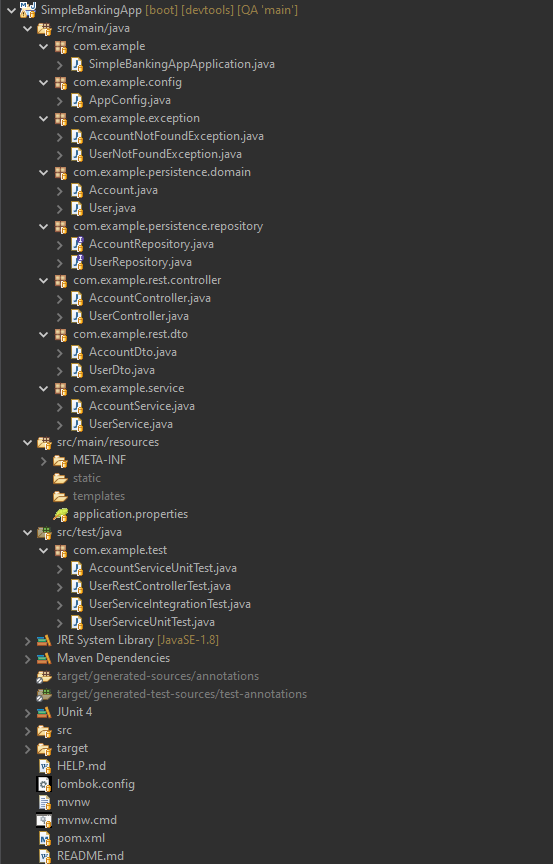

# simple-banking-app
## Sean Heathcote

### Introduction
_This is a simple banking app containing a 'user' CRUD app with one-to-many 'bank account' CRUD functionality._  
 
**Features**
* add new user  
* add new account  
* update user details  
* update account details  
* read all user details  
* read all account details  
* read a user's details from id  
* read an account's details from id  
* delete user from id  
* delete account from id  

### Project Structure

### Database

### Execution
##### Create user   
##### Read all users   
##### Read 1 user from id   
##### Update user   
##### Delete user   
##### Login Check   
##### Create account   
##### Read all accounts   
##### Read 1 account from id   
##### Update account   
##### Delete account   

### Testing
CRUD   
Rest init   
Create integration for user   

### Instructions for executing project:
* Ensure that port 8080 is free
* Ensure Lombok is installed onto STS
* Run project as Spring Boot App from project explorer
* (currently) no front end is available for inputting data, so POSTMAN will have to be used with the http addresses assigned in the user and account controllers.

### Future Revisions
In the future I would like to provide functionality (such as interest rates and penalties for withdrawing money) from certain account types. I would like to add a front end to make logging in and CRUD operations much more user-friendly.

#### Tools used:
* Java
* Spring Boot (STS4)
* MySQL
* Maven
* GitHub
* Git

